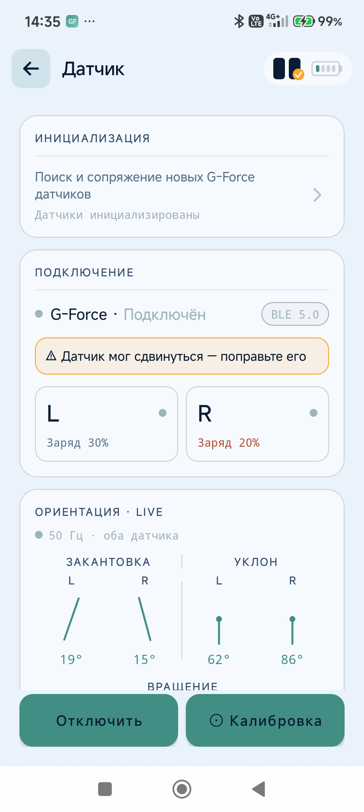
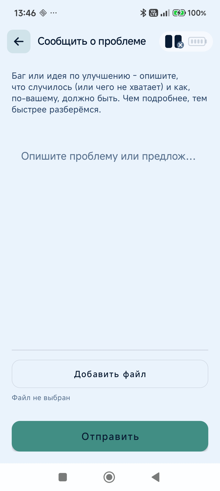
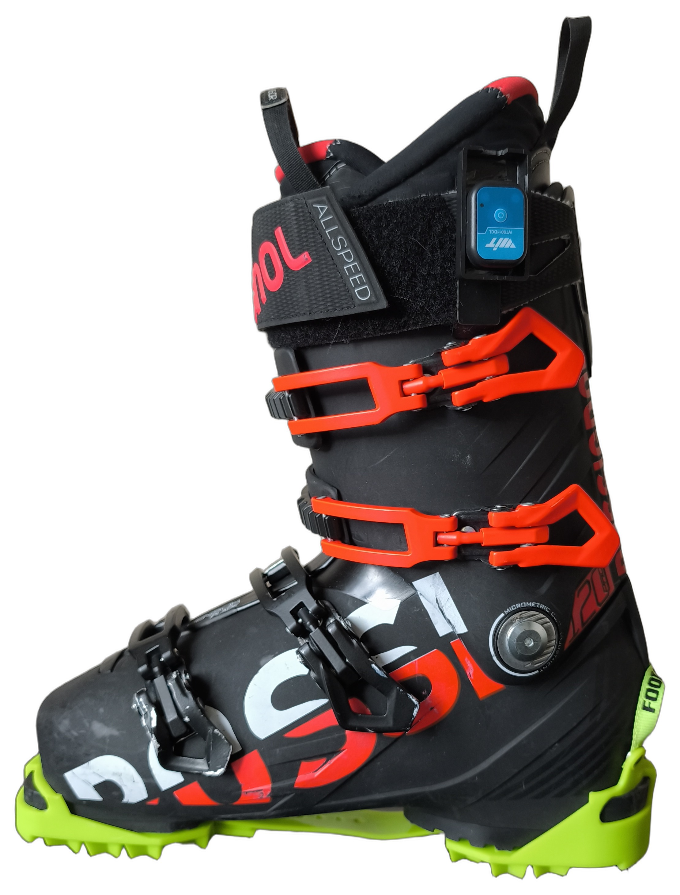

# G-Force Skiing - руководство пользователя

G-Force Skiing - персональный лыжный тренер в кармане. Датчики на ботинках, приложение считает **GF
Score**, разбирает технику по метрикам и подсказывает, какой навык тренировать дальше - поворот за
поворотом. Без датчиков работает как GPS-трекер маршрутов, которыми можно поделиться с друзьями.

**Как это работает.** Два небольших датчика крепятся на горнолыжные ботинки и по Bluetooth передают
в телефон, как наклоняются и разворачиваются ваши лыжи - много раз в секунду. Приложение само
находит в этом потоке отдельные повороты, измеряет каждый по десятку характеристик (насколько сильно
вы поставили лыжу на кант, насколько круглой вышла дуга, одинаково ли работали левая и правая нога)
и сводит их в одно понятное число - GF Score. Это не оценка «хорошо или плохо» вообще, а оценка
того, насколько ваши повороты похожи на технически правильные для той манеры катания, которую вы
сами выбрали перед спуском.

**Про название оценки.** Одно и то же число в разных местах интерфейса подписано то как **GF Score
**,
то как **GForce Score** - это один и тот же показатель. В руководстве он везде называется **GF Score
**.

**Термины в одну строку:** *спуск* - один проезд вниз; *сессия* - день катания (много спусков и
подъёмников); *GF Score* - оценка спуска 0–100; *навык* - одна отрабатываемая деталь техники,
уровень 0–30; *дисциплина* - набор навыков (Параллельные лыжи, Карвинг, Короткий радиус);
*техника* - что вы выбираете при старте сессии, она задаёт веса метрик в GF Score.

---

## Быстрый старт

1. **Соберите датчики** - фирменных покупать не нужно, пара собирается за ~5000 ₽ (
   раздел [14](#14-как-собрать-датчик-своими-руками)). Можно начать и без них: см. шаг 5.
2. **Привяжите их** - «Конфигурация» → «Датчик» → «Поиск и сопряжение» (
   раздел [2.1](#21-привязка-датчиков-первое-подключение)).
3. **Откалибруйте** - нейтральная стойка на ровном, кнопка «Калибровка» (
   раздел [2.3](#23-калибровка-и-контроль-положения-датчика)).
4. **Заполните профиль** - вес и радиус лыжи влияют на расчёты (раздел [3](#3-профиль-лыжника)). Там
   же удалите демо-данные.
5. **Начните сессию** - «Склон» → выбрать режим и технику → «▶ Поехали» (
   раздел [5.1](#51-начало-сессии)). Дальше приложение всё пишет само.
6. **Завершите день** - «■ Готово на сегодня». Смотрите разбор: «Расчёт» на карточке спуска (
   раздел [6](#6-gf-score-и-разбор-метрик)).

---

## Сценарии использования

### Свободное катание

Катаетесь в своё удовольствие - приложение пишет всё само, заглядывать в него по ходу не нужно.

1. Откройте окно **«Склон»** и нажмите кнопку начала сессии (раздел [5.1](#51-начало-сессии)).
2. Выберите режим (Трасса / Фрирайд / Обучение) и технику катания - от техники зависят веса метрик в
   GF Score (раздел [6](#6-gf-score-и-разбор-метрик)).
3. Нажмите **«▶ Поехали»**. Приложение само различает спуск и подъёмник и переключается между ними.
4. GF Score считается по ходу катания для каждого закрытого поворота; уровень навыка за спуск - это
   медиана по 8 лучшим поворотам этого спуска (раздел [5](#5-экран-склон-и-начало-сессии)).
5. Закончив на сегодня, нажмите **«■ Готово на сегодня»**. Если не нажать - сессия закроется сама
   через час без движения, но может записать вашу дорогу домой, так что лучше закрыть ее
   принудительно.

### Тренировка навыка

Отработка одного конкретного навыка. Приложение следит только за его метриками и уведомляет звуком,
когда поворот выполнен правильно.

1. Откройте навык («Тренировка» → дисциплина → навык, раздел [10](#10-тренировки)) и нажмите *
   *«Тренировать»**.
2. Сессия создаётся сама: если активной сессии режима «Тренировка» с нужной техникой нет, приложение
   её запустит - при необходимости завершив предыдущую.
3. Каждый засчитанный поворот отмечается коротким звуковым сигналом - «дзынь». Играет один из двух
   разных звуков - какой именно, показывает, насколько хорошо выполнен поворот:

   - **Первый сигнал** - поворот дотянул минимум до 70% порога следующего уровня по всем метрикам
     навыка.

     [▶ Первый сигнал](assets/user-guide/chime-1.wav)

   - **Второй сигнал** - поворот полностью, по всем метрикам, достиг или превысил порог следующего
     уровня.

     [▶ Второй сигнал](assets/user-guide/chime-2.wav)

   Если поворот не дотянул даже до 70% - сигнала не будет.
4. Уровень засчитывается, когда вы проедете **подряд** нужное число поворотов (обычно 8 - указано на
   экране цели), каждый из которых получил **второй сигнал** (100% по всем метрикам навыка).
5. Кнопка **«Тренировать»** на экране навыка становится **«Стоп»** - нажмите её, чтобы завершить
   тренировку. Открыли другой навык той же дисциплины - сессия не прерывается, кнопка на нём сама
   покажет «Стоп»; открыли навык другой дисциплины (другая техника) - текущая сессия закроется,
   начнётся новая. Как и обычная сессия, она также закроется через «■ Готово на сегодня» на «Склоне»
   или сама - через час без движения.

### Запись трека без датчиков

Без датчиков приложение работает как обычный GPS-трекер: пишет маршрут, скорость и высоту спуска, но
ничего не знает о технике катания.

1. Настройте сессию как обычно (раздел [5.1](#51-начало-сессии)) - привязывать датчики не нужно.
2. Спуски, подъёмники, время, расстояние, перепад, максимальная скорость и калории считаются от GPS.
3. GF Score и уровни навыков **не считаются** - для них нужны данные с датчиков.
4. Завершите сессию - **«■ Готово на сегодня»**.
5. Откройте спуск из истории → **«Поделиться»** (раздел [12](#12-треки-друзей)).

---

## Содержание

1. [Первый запуск](#1-первый-запуск)
2. [Датчики](#2-датчики)
3. [Профиль лыжника](#3-профиль-лыжника)
4. [Мои успехи (дашборд)](#4-мои-успехи-дашборд)
5. [Экран «Склон» и начало сессии](#5-экран-склон-и-начало-сессии)
6. [GF Score и разбор метрик](#6-gf-score-и-разбор-метрик)
7. [Видео с графиком score](#7-видео-с-графиком-score)
8. [История спусков](#8-история-спусков)
9. [Находки - трассы, которые не удалось распознать](#9-находки--трассы-которые-не-удалось-распознать)
10. [Тренировки](#10-тренировки)
11. [Офлайн-карты и вклад в OSM](#11-офлайн-карты-и-вклад-в-osm)
12. [Треки друзей](#12-треки-друзей)
13. [Настройки приложения](#13-настройки-приложения)
14. [Как собрать датчик своими руками](#14-как-собрать-датчик-своими-руками)
15. [Если что-то не работает](#15-если-что-то-не-работает)

---

## 1. Первый запуск

Экран приветствия: краткое описание возможностей и ключевые цифры - частота опроса датчика,
автономность, количество метрик, время калибровки.

Нажмите **«Продолжить →»** - откроется главный экран **«Мои успехи»**.

> Датчики на этом шаге не обязательны: без них можно записывать треки по GPS и делиться ими (
> раздел [8](#8-история-спусков)).

> **Демо-данные.** Приложение приходит заполненным: несколько спусков, пара «расшаренных» треков
> друзей, стартовый прогресс по навыкам - чтобы дашборд, история и тренировки были видны ещё до
> первого катания. Перед реальным использованием удалите их: «Удалить все данные» в
> разделе [13](#13-настройки-приложения).

---

## 2. Датчики

### 2.1 Привязка датчиков (первое подключение)

Открывается автоматически при первой настройке или вручную: **«Конфигурация»** → карточка **«Датчик»
** → **«Поиск и сопряжение новых G-Force датчиков»**.

1. **Включите оба датчика** - одно короткое нажатие кнопки, держать не нужно. Индикатор быстро
   замигает.
2. **«Начать поиск»** → выберите найденные датчики → дождитесь зелёной лампочки на обоих.
3. **Встряхните один датчик** - он станет **левым**, второй автоматически правым.

Выключение датчика: зажмите кнопку - индикатор загорится ровным светом, затем погаснет.

> Настройка выполняется один раз. Повторное открытие экрана запускает сопряжение заново - открывайте
> его только для перепривязки.

### 2.2 Экран «Датчик» - статус, заряд, калибровка

Состояние подключения, заряд каждого датчика и живые данные ориентации (закантовка, уклон, вращение)
с обоих датчиков. Частота опроса - 100 Гц, как и указано на экране приветствия.

- **Отключить** - разрывает BLE-соединение на сессию; привязка сохраняется.
- **Калибровка** - внизу экрана; как и когда её делать - раздел
  [2.3](#23-калибровка-и-контроль-положения-датчика).
- **Сырой поток** - посекундные значения акселерометра и гироскопа. Обычному пользователю не нужен,
  но доступен всем.

### 2.3 Калибровка и контроль положения датчика

Датчики необходимо откалибровать перед катанием - это привязывает «ноль» ориентации именно к тому,
как сейчас закреплён каждый датчик на конкретном ботинке. Достаточно сделать это один раз: перед
каждым катанием повторять не обязательно, но лишняя калибровка не навредит.

1. Закрепите оба датчика на ботинках (раздел [14.3](#143-крепление-на-ботинок)).
2. Поставьте ботинки на ровную поверхность (надевать и стоять в них необязательно - датчику важно
   только положение самого ботинка) - не нужно специально выпрямлять их или подпирать, обычная
   ровная постановка.
3. Нажмите **«⊙ Калибровка»** внизу экрана «Датчик» и не двигайтесь 2–3 секунды. Приложение
   усредняет показания за это время и запоминает текущее положение каждого датчика как «ровно».

Калибровку можно проводить неограниченное количество раз - это не разовая настройка «на всю жизнь
датчика», а просто фиксация текущего нейтрального положения. Её основная цель - сообщить приложению,
как именно сейчас закреплён датчик, чтобы отсчитывать наклоны от этой точки. Если вы перестегнули
ремешок, переставили датчик на другую ногу или просто не уверены, что положение верное -
откалибруйте заново, это не навредит и займёт пару секунд.

Если датчик всё же немного наклонился и калибровку не обновили, максимум что от этого может
пострадать - угол склона (экспериментальная метрика «Наклон склона»). На остальные метрики (углы
закантовки, синхронность лыж, TPC и другие) это не влияет.

Калибровка сохраняется на телефоне и переживает переподключение, перезапуск приложения и даже смену
датчиков местами - повторять её нужно только если датчик физически сдвинулся на ботинке, ремешок
ослаб, или вы переставили датчик на другую ногу.

> В отличие от смещения датчика во время катания (см. ниже), смену ноги приложение само не
> отслеживает. Проверить, что датчик закреплён на нужной стороне, можно на экране «Датчик» по данным
> ориентации в реальном времени (раздел [2.2](#22-экран-датчик--статус-заряд-калибровка)).

**Если датчик сдвинулся во время катания или тренировки.** Приложение непрерывно, в фоне, сравнивает
текущее положение каждого датчика с тем, что было записано при калибровке. Если положение заметно
отличается несколько секунд подряд (датчик съехал под ремешком, датчик случайно задели) - приложение
честно об этом предупредит, а не будет молча считать метрики по неверным данным:

- жёлтый мигающий индикатор датчиков в верхней части **любого** экрана приложения, не только
  «Датчик»;
- предупреждение **«⚠ Датчик мог сдвинуться - поправьте его»** - прямо на экране «Датчик» (баннер
  над карточками L/R) и в уведомлении в шторке;
- телефон завибрирует - сразу при обнаружении, затем повторно каждые ~20 секунд, пока проблема не
  устранена. Так вы заметите проблему, даже если телефон в кармане и экран не смотрите.

Что делать: верните датчик в исходное положение на ботинке (заново калибровать не обязательно, если
он просто съехал и вы его поправили обратно) - либо, если теперь он закреплён иначе осознанно,
откалибруйте повторно тем же способом, что и в начале.

> Предупреждение и вибрация автоматически прекращаются, как только положение датчика снова совпадает
> с калибровкой, либо после повторной калибровки.

---

## 3. Профиль лыжника

**«Конфигурация»** → карточка **«Лыжник»**.

| Поле                     | Зачем нужно                                                                                    |
|--------------------------|------------------------------------------------------------------------------------------------|
| **Имя**                  | подпись при шаринге треков                                                                     |
| **Уровень**              | задаёт порог «навык освоен» (7 / 17 / 27 из 30), рекомендации после спуска и доступные техники |
| **Радиус лыжи** (8–30 м) | радиус бокового выреза ваших лыж - в расчёте метрик карвинга                                   |
| **Вес** (30–150 кг)      | оценка калорий                                                                                 |

**Новичок** и **Средний** выбираются вручную. **Эксперт** присваивается автоматически, когда
прогресс навыков достигнут по всем трём дисциплинам - вручную его выбрать нельзя.

> Пока выбран **«Новичок»**, техники «Карвинг» и «Короткий радиус» недоступны - ни для сессии на
> «Склоне» (раздел [5.1](#51-начало-сессии)), ни для тренировки навыков (
> раздел [10](#10-тренировки)):
> открыта только «Параллельные лыжи». Смена уровня - ручное действие, не привязанное к реальному
> прогрессу по навыкам: достаточно переключить профиль на «Средний», и обе техники сразу станут
> доступны.

> Экспорт/импорт данных и полный сброс - в разделе [13](#13-настройки-приложения), не здесь.

---

## 4. Мои успехи (дашборд)

Главный экран (вкладка **«Дом»**). Статистика текущего сезона; сезон определяется автоматически по
датам последних сессий - переключателя сезона нет.

- **GF SCORE** - лучший результат за сезон, с графиком последних сессий.
- **Всего** - время на склоне, расстояние, число спусков.
- **Рекорды** - макс. скорость, макс. вертикаль, самый длинный спуск, лучший GF Score.

Ниже - уровень по каждой дисциплине (**Параллельные лыжи**, **Карвинг**, **Короткий радиус**);
кольцо показывает уровень по шкале 0–30.

> Диапазоны 1–10 / 11–20 / 21–30 подписаны как «Новичок» / «Средний» / «Эксперт». Это метка
> достигнутого уровня, а не ступень, которую нужно «открывать» - шкала одна и та же, от 0 до 30.

---

## 5. Экран «Склон» и начало сессии

Окно **«Склон»** (средняя иконка нижней навигации) - центр управления сессиями.

- **Последний / Текущий спуск** - карточка с картой трека, GF Score и статистикой (время, повороты,
  перепад, калории).
- **Основные навыки** - по итогам последнего спуска: карточка **«Освоено»** с лучшим по-настоящему
  освоенным навыком (если такой уже есть) и до двух карточек **«Поработать над этим»** - следующими
  по очереди навыками, которые ещё не освоены.
- Ниже, после прокрутки - **История**, **Треки друзей**, **Находки**:

### Как считаются рекомендации «Освоено» и «Поработать над этим»

Идея простая: приложение не хвалит за один удачный спуск и не ругает за один неудачный, а смотрит,
что вы умеете **стабильно**. Поэтому уровень навыка поднимается только тогда, когда результат
повторяется из раза в раз, а в «Поработать над этим» попадает самый простой из ещё не освоенных
навыков - тот, за который логично взяться следующим. Ниже - как это считается.

1. Навыки внутри дисциплины идут по порядку сложности - это встроенная программа обучения.
2. Для навыка берутся все завершённые спуски **этой же техникой** за последние 9 месяцев.
3. По каждому спуску, где было не меньше 8 поворотов, считается свой уровень 0–30: берутся 8 лучших
   поворотов по этому навыку (необязательно подряд) и вычисляется медиана. Спуски короче 8 поворотов
   не учитываются.
4. **Подтверждённый уровень** - не последний спуск и не лучший, а **5-й по величине** среди таких
   спусков. Нужно минимум 5 засчитанных спусков, иначе уровень = 0. Так одна удачная сессия не
   завышает прогресс.
5. **«Освоено»** - среди навыков, чей подтверждённый уровень уже достиг порога «освоено» для вашего
   Уровня (7 / 17 / 27 из 30 - раздел [3](#3-профиль-лыжника)), показывается тот, где подтверждённый
   уровень выше всех остальных. Если таких навыков ещё нет - карточки не будет.
6. **«Поработать над этим»** - по порядку ищется первый навык, где подтверждённый уровень ниже
   порога «освоено». Он и следующий за ним становятся карточками (максимум 2).
7. Если навыков ниже порога не осталось - дисциплина на вашем Уровне полностью освоена: карточек
   «Поработать над этим» не будет, вместо них - поздравление с предложением попробовать другую
   технику.

### 5.1 Начало сессии

Кнопка внизу экрана открывает настройку сессии.

| Режим          | Что делает                                                |
|----------------|-----------------------------------------------------------|
| **Трасса**     | тихая запись, без подсказок                               |
| **Фрирайд**    | один спуск, вне трасс                                     |
| **Обучение**   | разбор после спуска                                       |
| **Тренировка** | уведомления о правильном выполнении прямо во время спуска |

«Обучение» и «Тренировка» требуют подключённых датчиков - без них при выборе появится сообщение
«Нужны подключённые датчики», режим не переключится.

Если запустить «Тренировку» так, без выбора конкретного навыка (раздел [10](#10-тренировки)), звуковой
сигнал (см. выше) работает по-другому: каждый поворот сравнивается не с порогом навыка, а с вашим
обычным GF Score - средним по недавним спускам этой же техникой. Первый сигнал - поворот дотянул
минимум до 70% от обычного счёта, второй - сравнялся с ним или превысил.

Прокрутите вниз и выберите технику катания - она задаёт веса метрик в GF Score:

**«▶ Поехали»** запускает запись. Пока сессия активна, кнопка внизу экрана «Склон» меняется на **«■
Готово на сегодня»**:

---

## 6. GF Score и разбор метрик

Откройте спуск из истории или с карточки «Последний спуск»:

Зелёная карточка - итоговый **GF Score**, время / повороты / перепад / калории и макс. скорость.
Кнопка **«Расчёт»** открывает разбивку:

Счёт устроен просто. У каждой метрики есть свой разумный диапазон - от значения, типичного для
начинающего, до значения, типичного для эксперта. Ваш результат переводится в проценты внутри этого
диапазона: 0% - вы у нижней границы, 100% - у верхней или выше. Затем проценты складываются не
поровну, а с весами по выбранной технике: в карвинге больше всего значат перегрузка и форма дуги, в
коротком радиусе - перегрузка и синхронность лыж. Сумма весов всегда 100%, поэтому GF Score - это
число от 0 до 100.

Отсюда главное следствие: **сравнивать между собой имеет смысл только спуски одной техникой.** Один
и тот же проезд, посчитанный как «Карвинг» и как «Параллельные лыжи», даст разные числа - не потому
что вы катались по-разному, а потому что от вас ожидали разного.

Набор метрик один и тот же - от техники зависят веса и, значит, порядок в разбивке.

**Порядок метрик по убыванию веса:**

| Техника               | Метрики по убыванию веса                                                                                                                                                                                                                |
|-----------------------|-----------------------------------------------------------------------------------------------------------------------------------------------------------------------------------------------------------------------------------------|
| **Карвинг**           | Перегрузка → Форма поворота → Сброс давления → Скорость закантовки / Угол закантовки / Завершённость поворота (примерно поровну) → Синхронность лыж → Набор угла → Доля параллельной фазы → Плавность кантования                        |
| **Короткий радиус**   | Перегрузка → Синхронность лыж → Сброс давления → Угол закантовки → Скорость вращения → Форма поворота → Доля параллельной фазы                                                                                                          |
| **Параллельные лыжи** | Форма поворота → Перегрузка / Ритм поворотов / Плавность кантования (примерно поровну) → Сброс давления / Угол закантовки (примерно поровну) → Синхронность лыж → Доля параллельной фазы → Скорость закантовки → Завершённость поворота |

**Что означает каждая метрика:**

| Метрика                    | Что измеряет                                                | Хорошо выглядит так                                               |
|----------------------------|-------------------------------------------------------------|-------------------------------------------------------------------|
| **Перегрузка**             | пиковая боковая перегрузка в повороте, g                    | выше скорость и меньше радиус - больше G; у экспертов 2–3 g       |
| **Форма поворота**         | равномерность прохождения дуги                              | ближе к минимуму - чистая круглая дуга; выше - угловатая дуга, юз |
| **Сброс давления**         | разгрузка лыж в момент смены канта                          | активная разгрузка облегчает вход в следующий поворот             |
| **Скорость закантовки**    | как быстро меняется угол закантовки                         | быстрая, решительная - против вялого кантования                   |
| **Угол закантовки**        | максимальный наклон лыжи на ребро                           | у экспертов 50–70°                                                |
| **Завершённость поворота** | на сколько градусов довёрнуты лыжи                          | большой угол - закрытый поворот с контролем скорости              |
| **Синхронность лыж**       | согласованность левой и правой лыжи                         | высокая - лыжи работают как одно целое                            |
| **Набор угла**             | равномерность нарастания угла в рабочей фазе                | ровное нарастание - контроль дуги через весь апекс                |
| **Доля параллельной фазы** | сколько поворота лыжи идут параллельно, а не в плуге        | выше - меньше плуге                                               |
| **Плавность кантования**   | стабильность угла без рывков                                | высокая - чистый рез; низкая - соскальзывание, «дребезжание»      |
| **Скорость вращения**      | доворот лыж в закантованной фазе (только «Короткий радиус») | -                                                                 |
| **Ритм поворотов**         | поворотов в минуту (скользящее среднее)                     | высокий - короткие быстрые повороты                               |

В конце экрана - два инсайта:

- **Больше всего влияет** - метрика с наибольшим вкладом в оценку.
- **Больше всего запаса** - метрика, где разница между весом и фактическим вкладом наибольшая, то
  есть больше всего можно «добрать».

Нажатие на метрику или инсайт разворачивает описание и - если у метрики есть привязанный навык -
ссылку на тренировку.

---

## 7. Видео с графиком score

Если во время сессии велась видеозапись (кнопка-камера в шапке экрана «Склон»), на карточке спуска и
на экране расчёта появляется **«▶ Видео»** - совместное воспроизведение видео и графика GF score с
бегущим маркером:

- **Пауза / Играть** - остановить и возобновить.
- **Стоп** - пауза и перемотка в начало, маркер сбрасывается на 0.
- **1× / 0.5× / 0.25×** - скорость воспроизведения; медленные удобны для покадрового разбора.

---

## 8. История спусков

Карточка **«История»** на экране «Склон» → список курортов, где вы катались:

Выберите курорт - откроется список спусков с фильтром **Сегодня / Сезон / Всё время**:

Сверху сводная карточка за выбранный период (лучшая оценка, число спусков, суммарные повороты /
перепад / калории), ниже - спуски по датам. **«Очистить историю»** удаляет спуски выбранного
курорта; профиль и прогресс навыков не затрагивает.

> Спуски из тренировок (раздел [10](#10-тренировки)) попадают в общую историю наравне с обычными -
> отдельного списка для них нет, но под названием спуска есть пометка «Тренировка».

---

## 9. Находки - трассы, которые не удалось распознать

Если GPS-трек не удалось сопоставить с известной трассой (нет офлайн-данных курорта либо трассы ещё
нет в OpenStreetMap), спуск попадает в **«Находки»**. В списке только 10 последних, самые новые
сверху:

Нажмите запись, чтобы добавить её на карту вручную.

**Трасса** - название курорта, название трассы, сложность:

**Подъёмник** - название курорта, название и тип (гондола / кресельный / бугельный):

- **«Пропустить»** убирает запись из «Находок» без отправки в OpenStreetMap. Сам трек остаётся в
  истории спусков.
- **«Добавить»** отправляет трек в OpenStreetMap - нужен подключённый OSM-аккаунт (
  раздел [11.2](#112-интеграция-с-osm)).

---

## 10. Тренировки

Вкладка **«Тренировка»** → дисциплина:

В дисциплине (Параллельные лыжи / Карвинг / Короткий радиус) - набор навыков с текущим уровнем 0–30:

Внутри навыка - описание, текущий уровень, ссылка «Как измеряется» и цель следующего уровня с
коротким обучающим видео:

Ниже - числовая цель уровня (например, «8 поворотов подряд с шириной плуга < 10°») и кнопка *
*«Тренировать»**, запускающая тренировку на склоне. Во время тренировки она превращается в **«Стоп»
** - нажмите повторно, чтобы завершить сессию. Если перейти на другой навык той же дисциплины,
сессия не прерывается и кнопка там сразу показывает «Стоп»; переход в другую дисциплину завершает
текущую сессию и начинает новую. Если навык не даётся - блок **«Застряли? Попробуйте упражнение»** с
видео вспомогательных упражнений:

> GF Score во время тренировки считается так же, как в обычной сессии, а сам спуск после завершения
> попадает в общую историю (раздел [8](#8-история-спусков)) с пометкой «Тренировка» под названием.

Другая дисциплина, «Карвинг», со своим набором навыков:

---

## 11. Офлайн-карты и вклад в OSM

### 11.1 Офлайн-данные

**«Конфигурация»** → карточка **«Карта»** - загрузка трасс и подъёмников из OpenStreetMap:

- **Всё в радиусе 20 км** - область вокруг текущего местоположения; при открытии экрана карта
  позиционируется по GPS. Точку можно сменить вручную: открыть карту на весь экран, переместить и
  свернуть обратно - следующая загрузка пойдёт вокруг новой точки. **«Обновить»** заново запрашивает
  весь регион целиком и обновляет совпадающие объекты - если, например, в OpenStreetMap просто
  исправили название трассы, изменение подхватится. Но если трассу в OpenStreetMap не
  отредактировали,
  а переразметили как новый объект (например, перерисовали линию) - старая запись никуда не денётся
  и не пометится как устаревшая, а появится рядом как дубликат. Приложение вообще не отслеживает и
  не умеет определить, что объект пропал или заменён. Убрать дубликаты и гарантированно получить
  актуальные данные можно только полным сносом: корзина у курорта ниже, затем закачать регион
  заново.
- **Загруженные курорты** - скачанные курорты с числом трасс и подъёмников; у каждого своя кнопка
  обновления и корзина.

Автоматической докачки нет - новые регионы нужно загружать вручную кнопкой «Обновить область» выше.

Нажатие на превью открывает карту на весь экран - жесты масштабирования и перемещения:

> Если нет интернета и карта в этом месте не скачана заранее, вместо пустого фона показывается
> значок
> карты и надпись «Нет соединения».

### 11.2 Интеграция с OSM

Отдельная карточка в «Конфигурации» - загрузка ваших треков в OpenStreetMap:

1. Нажмите **«Подключить OSM-аккаунт»** - в браузере откроется страница OpenStreetMap.
2. Войдите в аккаунт OpenStreetMap (или зарегистрируйте новый) и подтвердите доступ приложению.
3. Скопируйте показанный код авторизации.
4. Вернитесь в приложение, вставьте код во всплывшее окно и нажмите **«Подключить»**.

После подключения кнопка меняется на «Отключить», а находки (
раздел [9](#9-находки--трассы-которые-не-удалось-распознать)) можно отправлять на карту одной
кнопкой.

> Каждый подключает **свой** аккаунт OpenStreetMap, а не общий аккаунт приложения. Это было сделано
> намеренно:
> если кто-то отправит некорректные данные, санкции OpenStreetMap коснутся только его аккаунта, а не
> заблокируют загрузку для всех пользователей сразу.

---

## 12. Треки друзей

Треки, которыми с вами поделились, - карточка **«Треки друзей»** на экране «Склон»:

Список работает как своя история (фильтр Сегодня / Сезон / Всё время). Открытая запись показывает те
же детали спуска - карту, GF Score, статистику:

Поделиться своим спуском - кнопка **«Поделиться»** на экране деталей любого своего спуска (
раздел [6](#6-gf-score-и-разбор-метрик)).

---

## 13. Настройки приложения

Вкладка **«Конфигурация»** (последняя иконка нижней навигации) - вход во все разделы настроек:

| Карточка                | Куда ведёт                                                                                      |
|-------------------------|-------------------------------------------------------------------------------------------------|
| **Датчик**              | статус подключения, заряд, калибровка - раздел [2.2](#22-экран-датчик--статус-заряд-калибровка) |
| **Лыжник**              | профиль - раздел [3](#3-профиль-лыжника)                                                        |
| **Карта**               | офлайн-данные - раздел [11.1](#111-офлайн-данные)                                               |
| **Интеграция с OSM**    | загрузка треков - раздел [11.2](#112-интеграция-с-osm)                                          |
| **Сообщить о проблеме** | баг или предложение по улучшению - см. ниже                                                     |
| **Настройки**           | единицы измерения, автодетект начала спуска, экспорт/импорт, сброс данных                       |

- **Единицы** - метрические или имперские.
- **Автодетект начала спуска** - по умолчанию приложение само определяет начало спуска по GPS-скорости
  (раздел [5.1](#51-начало-сессии)). Выключите, если бывают ложные срабатывания - тогда спуск начнётся
  только по ручному старту.
- **«Экспорт / Импорт»** - ручной перенос данных на новый телефон: «Экспорт» сохраняет сессии,
  историю и настройки профиля; «Импорт» на новом телефоне восстанавливает всё из сохранённого. Не
  зависит от автоматического бэкапа Android (см. ниже) и не привязан к Google-аккаунту.
- **«Удалить все данные»** - полный необратимый сброс: все спуски, история, прогресс тренировок, в
  том числе демо-данные (раздел [1](#1-первый-запуск)). Демо- и реальные данные не различаются,
  стирается всё разом, повторно демо не создаётся.

> **Где лежат данные.** Только локально на устройстве, на сервер не отправляются. При переходе на
> новый телефон Android может перенести их своей штатной резервной копией (Google-аккаунт): на новом
> телефоне при первоначальной настройке выберите «Восстановить из резервной копии» и тот же
> Google-аккаунт. Бэкап на старом телефоне должен успеть сняться заранее - обычно сам, на Wi-Fi при
> зарядке, раз в 1–2 дня.

### 13.1 Сообщить о проблеме

Экран для обратной связи прямо из приложения - подходит и для бага, и для идеи по улучшению:

Опишите, что случилось (или чего не хватает) и как, по-вашему, должно быть, при желании приложите
файл (например, скриншот) кнопкой **«Добавить файл»** (до 1 МБ), и нажмите **«Отправить»**. Письмо
уходит через ваш собственный почтовый клиент на **gf_skiing@mail.ru** - само приложение ничего
никуда не отправляет само по себе. Единственное, что приложение хранит о вас - это имя в профиле
лыжника (раздел [3](#3-профиль-лыжника)), и вы вольны указать там просто ник, а не настоящее имя.

Чекбокс **«Приложить логи и базу данных»** включён по умолчанию для отчётов об ошибках: вместе с
письмом уйдёт архив с техническим логом приложения и локальной базой ваших тренировок - это сильно
упрощает разбор причины бага. Вы можете снять галочку и отправить отчёт без вложения, но тогда
разобраться в проблеме без лога и данных сессии будет намного сложнее.

---

## 14. Как собрать датчик своими руками

G-Force не привязан к фирменному «железу» - пара датчиков собирается самостоятельно из недорогих
компонентов с маркетплейса.

### 14.1 Что понадобится

На **один** датчик; для работы приложения нужны **два** - на левую и правую ногу:

| Деталь                    | Роль                                                                                   | Примерная цена           |
|---------------------------|----------------------------------------------------------------------------------------|--------------------------|
| **WITMOTION WT9011DCL**   | BLE-модуль с акселерометром, гироскопом и магнитометром - передаёт данные в приложение | основная часть стоимости |
| **Пластиковая коробочка** | корпус, защита платы от влаги и ударов                                                 | -                        |
| **Металлическая клипса**  | крепление на ремень ботинка                                                            | -                        |

Всё куплено на Ozon; себестоимость одного датчика в сборе - около **2500 ₽**, пары - ~5000 ₽.
Заметно дешевле готовых фирменных решений с той же функциональностью.

Инструменты: небольшая крестовая отвёртка (клипса крепится винтами) и, желательно, двусторонний
скотч или термоклей - если посадка датчика в коробочке окажется свободной.

### 14.2 Сборка

1. Уложите WT9011DCL в нижнюю часть коробочки кнопкой вверх - внутренние рёбра корпусов такого
   размера обычно фиксируют плату без люфта.
2. Закройте крышку до щелчка или затяните штатный винт, если он есть.
3. Прикрутите клипсу к задней стенке корпуса - как правило, двумя винтами через готовые отверстия.

Повторите для второго датчика. Какой из них станет левым, а какой правым, на этапе сборки не важно -
это определяется при первом сопряжении: вы встряхиваете один датчик, он назначается левым (
раздел [2.1](#21-привязка-датчиков-первое-подключение)).

### 14.3 Крепление на ботинок

Клипса рассчитана на крепление сбоку ботинка, на ремне - так, чтобы датчик плотно прилегал и не
болтался: любой люфт добавляет шум в данные акселерометра и гироскопа. Крепите оба датчика *
*симметрично**, на одном и том же месте на обоих ботинках, иначе показания закантовки несопоставимы
между ногами.

> После сборки выполните калибровку в нейтральной стойке (
> раздел [2.2](#22-экран-датчик--статус-заряд-калибровка)). В новом корпусе возможен небольшой дрейф
> магнитометра из-за металла клипсы - если курс или вращение нестабильны, откалибруйте ещё раз, стоя
> на лыжах в ботинках.

### 14.4 Обслуживание

- Заряжайте через штатный разъём на плате WT9011DCL: при зарядке индикатор красный, при полном
  заряде - зелёный.
- Уровень заряда каждого датчика виден на экране «Датчик» (раздел
  [2.2](#22-экран-датчик--статус-заряд-калибровка)) и подсвечен по проценту: зелёный - выше 50%,
  жёлтый - от 21% до 50%, красный - 20% и ниже.
- Пластиковый корпус не герметичен - не оставляйте датчики в снегу надолго и просушивайте корпус
  изнутри, если внутрь попала влага.
- Периодически проверяйте затяжку винтов клипсы: вибрация при катании со временем их ослабляет.

---

## 15. Если что-то не работает

| Симптом                               | Что проверить                                                                                                                                                                                                |
|---------------------------------------|--------------------------------------------------------------------------------------------------------------------------------------------------------------------------------------------------------------|
| Датчики не находятся при поиске       | Включены ли оба (индикатор мигает); включён ли Bluetooth и выданы ли разрешения на геолокацию                                                                                                                |
| GF Score не считается, метрики пустые | Датчики подключены? Без них считаются только GPS-метрики (раздел «Запись трека без датчиков»)                                                                                                                |
| Уровень навыка не растёт              | Нужно **5** спусков с засчитанным результатом и не меньше 8 поворотов в каждом; в тренировке - 8 правильных поворотов **подряд** (раздел [5](#5-экран-склон-и-начало-сессии))                                |
| Спуск попал в «Находки»               | Курорта нет в офлайн-данных или трассы нет в OpenStreetMap - загрузите регион (раздел [11.1](#111-офлайн-данные)) или добавьте трассу вручную (раздел [9](#9-находки--трассы-которые-не-удалось-распознать)) |
| Карта пустая, «Нет соединения»        | Тайлы не скачаны и сети нет - загрузите регион по Wi-Fi заранее                                                                                                                                              |
| Показания закантовки разные по ногам  | Датчики закреплены несимметрично или один болтается (раздел [14.3](#143-крепление-на-ботинок)); перекалибруйте                                                                                               |
| Сессия не закрылась                   | Нажмите «■ Готово на сегодня»; иначе закроется сама через час без движения                                                                                                                                   |
| «Добавить» в «Находках» не отправляет | Не подключён OSM-аккаунт (раздел [11.2](#112-интеграция-с-osm))                                                                                                                                              |

---

*Документация подготовлена для G-Force Skiing.*
