# G-Force Skiing — руководство пользователя

Полное руководство по всем экранам и функциям приложения.

G-Force Skiing — персональный лыжный тренер в кармане. Подключите датчики к ботинкам — приложение само считает GF Score, разбирает технику по метрикам и подсказывает, какой навык тренировать дальше, поворот за поворотом. Без датчиков тоже работает — как трекер маршрутов по GPS, которыми можно поделиться с друзьями. Ниже — три основных сценария использования.

## Сценарии использования

### Свободное катание

Катаетесь как обычно, в своё удовольствие, ни о чём не думая — приложение всё пишет само и считает статистику в фоне, лезть в него по ходу катания не нужно.

1. Откройте окно **«Склон»** и нажмите кнопку начала сессии (раздел [5.1](#51-начало-сессии)).
2. Настройте сессию: выберите режим (Трасса / Фрирайд / Обучение) и технику катания — от техники зависят веса метрик в GF Score (раздел [6](#6-gf-score-и-разбор-метрик)).
3. Нажмите **«▶ Поехали»** — начнётся запись. Дальше ничего настраивать не нужно: приложение само распознаёт, когда вы едете вниз (спуск) и когда поднимаетесь на подъёмнике, и переключается между этими состояниями автоматически.
4. GF Score считается по ходу катания для каждого закрытого поворота (в зависимости от выбранной техники, раздел [6](#6-gf-score-и-разбор-метрик)); уровень по каждому навыку — из 8 лучших поворотов спуска (необязательно подряд, просто самые сильные) через медиану между ними (раздел [5](#5-экран-склон-и-начало-сессии)).
5. По окончании катания на сегодня нажмите **«■ Готово на сегодня»** — это явно завершает сессию. Если не нажать, сессия завершится сама автоматически после часа без движения.

### Тренировка навыка

Целенаправленная отработка одного конкретного навыка, а не катание вообще. Приложение следит именно за теми метриками, которые входят в этот навык, и уведомляет, когда поворот выполнен правильно, — вместо общей статистики за весь спуск вы получаете прогресс по узкой цели.

1. Откройте нужный навык (вкладка «Тренировка» → дисциплина → навык, раздел [10](#10-тренировки)) и нажмите **«Тренировать»**.
2. Отдельно настраивать сессию не нужно — она создаётся автоматически: если сейчас нет активной сессии режима «Тренировка» с нужной техникой, приложение само её запускает (при необходимости сначала завершив то, что было активно до этого).
3. Во время спуска приложение уведомляет вас о правильном выполнении поворотов по ходу катания.
4. Уровень навыка засчитывается, когда вы подряд проедете нужное число поворотов (обычно 8, указано на экране цели навыка), каждый из которых проходит порог по всем метрикам этого навыка — именно подряд, не вразнобой.
5. Тренировочная сессия заканчивается так же, как обычная: вручную кнопкой **«■ Готово на сегодня»** на экране «Склон», либо сама — через час без движения. Если, не завершая текущую тренировку, вы откроете другой навык и снова нажмёте «Тренировать» (например, с Параллельных лыж переключитесь на Карвинг) — текущая сессия завершится, и сразу начнётся новая, уже под новую технику.

### Запись трека без датчиков

Датчиков ещё нет или не взяли их с собой — приложение всё равно может писать маршрут по GPS, а треком можно поделиться с друзьями.

1. Откройте окно «Склон» и настройте сессию как обычно (раздел [5.1](#51-начало-сессии)) — привязывать датчики необязательно.
2. Приложение по-прежнему само отслеживает спуски и подъёмники и считает время, расстояние, перепад высоты и калории — всё это работает от GPS, датчики на ботинках для этого не нужны.
3. GF Score и уровни навыков не считаются — для них нужны данные с датчиков (закантовка, повороты и т.д.), одного GPS недостаточно.
4. Завершите сессию как обычно — **«■ Готово на сегодня»**.
5. Откройте спуск из истории и нажмите **«Поделиться»** — трек уйдёт друзьям (раздел [12](#12-треки-друзей)), они увидят его в «Треки друзей» так же, как свои собственные.

---

## Содержание

1. [Первый запуск](#1-первый-запуск)
2. [Датчики](#2-датчики)
3. [Профиль лыжника](#3-профиль-лыжника)
4. [Мои успехи (дашборд)](#4-мои-успехи-дашборд)
5. [Экран «Склон» и начало сессии](#5-экран-склон-и-начало-сессии)
6. [GF Score и разбор метрик](#6-gf-score-и-разбор-метрик)
7. [Видео с графиком score](#7-видео-с-графиком-score)
8. [История спусков](#8-история-спусков)
9. [Находки — трассы, которые не удалось распознать](#9-находки--трассы-которые-не-удалось-распознать)
10. [Тренировки](#10-тренировки)
11. [Оффлайн-карты и вклад в OSM](#11-оффлайн-карты-и-вклад-в-osm)
12. [Треки друзей](#12-треки-друзей)
13. [Настройки приложения](#13-настройки-приложения)
14. [Как собрать датчик своими руками](#14-как-собрать-датчик-своими-руками)

---

## 1. Первый запуск

При первом запуске приложение показывает экран приветствия с кратким описанием возможностей и ключевыми цифрами: частота опроса датчика, автономность, количество метрик и время калибровки.

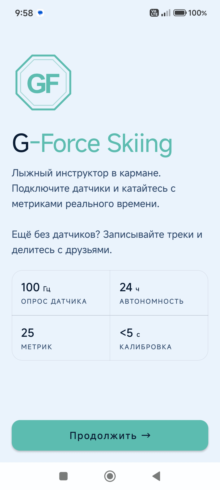

Нажмите **«Продолжить →»**, чтобы перейти на главный экран — **«Мои успехи»**.

> Датчики на этом шаге ещё не обязательны: без них можно записывать треки по GPS и делиться ими с друзьями (см. раздел [8](#8-история-спусков)).

> Приложение приходит с уже заполненными демонстрационными данными — несколько спусков, в том числе пара «расшаренных» треков друзей, и стартовый прогресс по навыкам. Это нужно, чтобы сразу увидеть, как выглядят дашборд, история и тренировки, ещё до первого реального катания. Перед началом использования эти данные стоит удалить — кнопка «Удалить все данные» в разделе [3](#3-профиль-лыжника).

---

## 2. Датчики

### 2.1 Привязка датчиков (первое подключение)

Открывается автоматически при первой настройке или вручную с главного экрана настроек (карточка **«Датчик»** → **«Поиск и сопряжение новых G-Force датчиков»**).

**Инструкция:**
1. Включите оба датчика (удерживайте кнопку ~2 сек) — индикатор мигнёт синим.
2. Нажмите «Начать поиск» → выберите найденные датчики → дождитесь зелёной лампочки на обоих.
3. Встряхните один из датчиков — он станет датчиком для **левой** ноги, второй автоматически станет правым.

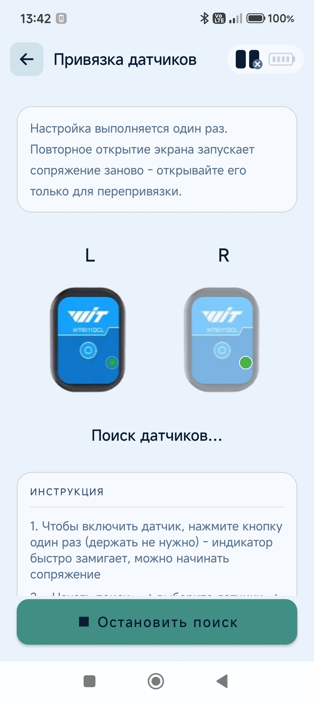

> Настройка выполняется один раз. Повторное открытие этого экрана запускает процесс сопряжения заново — используйте его только если нужно перепривязать датчики.

### 2.2 Экран «Датчик» — статус, заряд, калибровка

Показывает текущее состояние подключения, заряд каждого датчика и живые данные ориентации (закантовка, уклон, вращение — по 100 Гц с обоих датчиков).

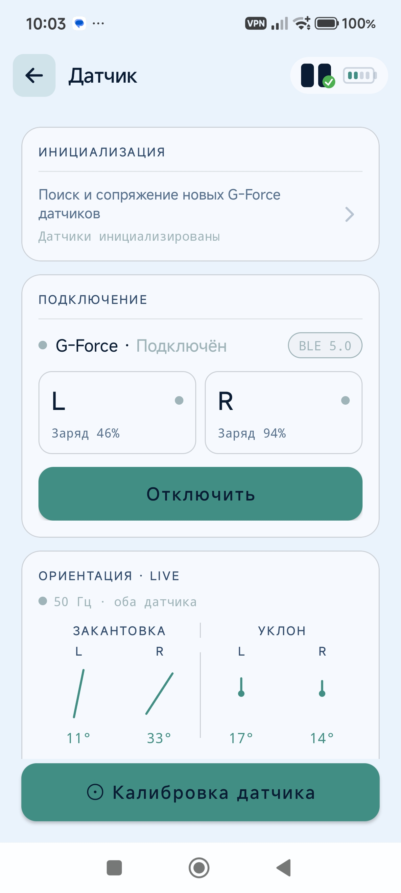

- **Отключить** — разрывает BLE-соединение (не забывает привязку, просто отключает на сессию).
- **Калибровка датчика** — внизу экрана; выполните перед началом катания, встав в нейтральную стойку на ровной поверхности.
- Здесь же виден блок «Сырой поток» с посекундными значениями акселерометра/гироскопа — обычному пользователю не нужен, но доступен всем.

---

## 3. Профиль лыжника

Открывается с главного экрана настроек (карточка **«Лыжник»**).

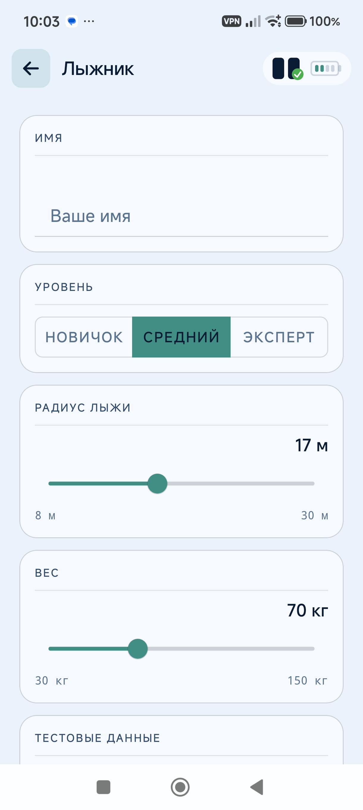

Поля:
- **Имя** — для подписи в шаринге треков.
- **Уровень** — Новичок / Средний выбираются вручную; Эксперт присваивается автоматически, когда вы реально достигнете нужного прогресса навыков по всем 3 дисциплинам — вручную выбрать его нельзя. Уровень влияет на то, при каком прогрессе навык считается освоенным, и какие рекомендации «Поработать над этим» показываются после спуска.
- **Радиус лыжи** (8–30 м) — радиус бокового выреза ваших лыж; используется в расчёте метрик карвинга.
- **Вес** (30–150 кг) — используется для оценки калорий.

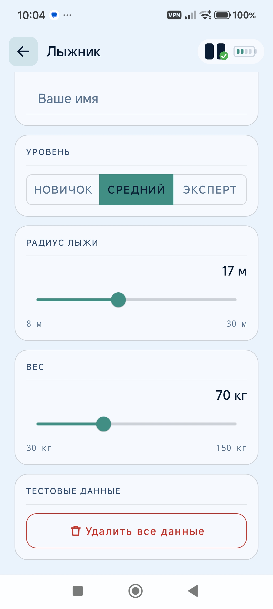

> **«Удалить все данные»** внизу экрана — это полный и необратимый сброс: удаляются все записанные спуски, история, прогресс тренировок — в том числе демонстрационные данные, которыми приложение заполнено при первой установке (см. раздел [1](#1-первый-запуск)). Единственный способ обнулить весь прогресс. Учтите: удаление не различает демо- и реальные данные, стирает всё разом, и повторно демо-данные не создаются.

> Все данные (спуски, история, прогресс навыков, профиль) хранятся только локально на устройстве, на сервер не отправляются. При переходе на новый телефон Android может перенести их автоматически — через свою стандартную резервную копию (Google-аккаунт). Для этого на **новом** телефоне при первоначальной настройке нужно выбрать «Восстановить из резервной копии» и указать тот же Google-аккаунт, что был на старом телефоне; сам бэкап на старом телефоне должен успеть сняться заранее (обычно происходит само по себе на Wi-Fi при зарядке, раз в 1–2 дня — не мгновенно после установки).

---

## 4. Мои успехи (дашборд)

Главный экран приложения (вкладка **«Дом»**). Показывает статистику текущего сезона — сезон определяется автоматически по датам последних сессий (без разрыва в несколько месяцев между ними), отдельного переключателя сезона на этом экране нет.

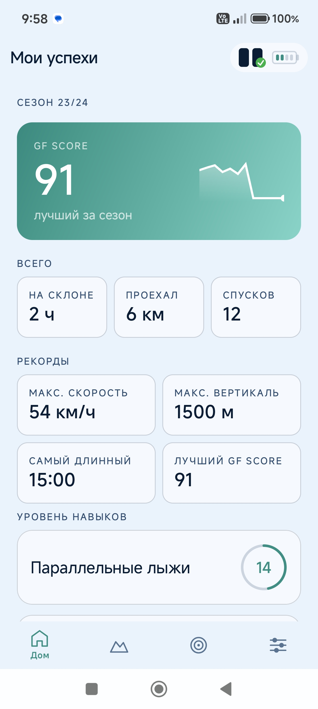

- **GF SCORE** — лучший результат за сезон, с небольшим графиком последних сессий.
- **Всего** — время на склоне, пройденное расстояние, число спусков.
- **Рекорды** — макс. скорость, макс. вертикаль, самый длинный спуск, лучший GF Score.

Ниже — уровень по каждой из трёх дисциплин (**Параллельные лыжи**, **Карвинг**, **Короткий радиус**), кольцо показывает текущий уровень навыка по шкале от 0 до 30. Диапазоны 1–10 / 11–20 / 21–30 подписываются как «Новичок» / «Средний» / «Эксперт» — это просто метка достигнутого уровня, а не отдельная ступень, которую нужно «открывать»: шкала для всех одна и та же от 0 до 30.

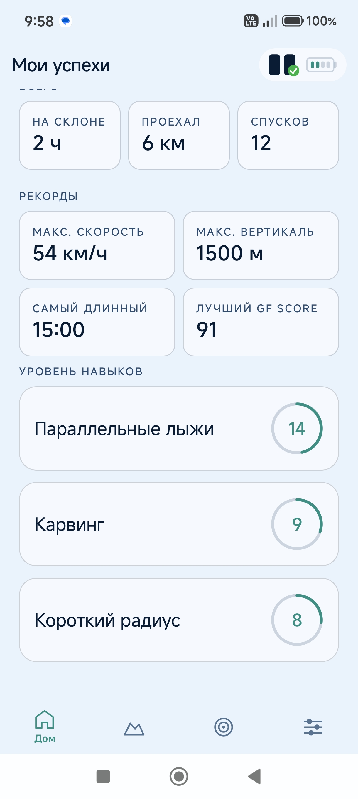

---

## 5. Экран «Склон» и начало сессии

Окно **«Склон»** (средняя иконка нижней навигации) — центр управления сессиями.

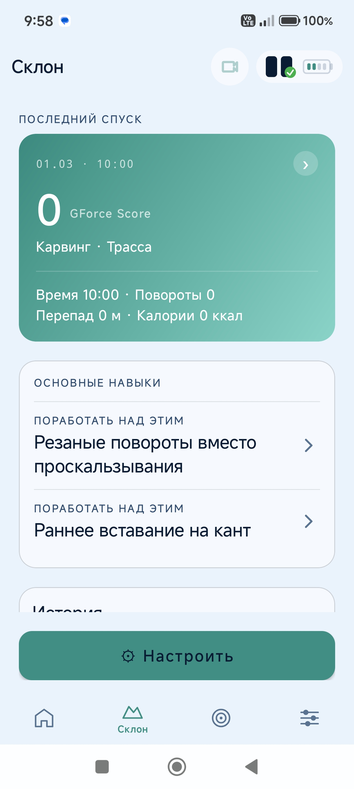

- **Последний спуск / Текущий спуск** — карточка с картой трека, GF Score, статистикой (время, повороты, перепад, калории).
- **Основные навыки** — до двух рекомендаций «Поработать над этим» по итогам последнего спуска.

> **Как считаются рекомендации.** Навыки в каждой дисциплине идут по порядку сложности (от простых к сложным — это встроенная программа обучения). Для каждого навыка берутся все ваши завершённые спуски этой же техникой катания за последние 9 месяцев; по каждому спуску, где было хотя бы 8 поворотов, считается свой уровень (0–30) — берутся 8 лучших поворотов спуска по этому навыку (необязательно подряд, просто самые сильные из всех) и вычисляется медиана между ними; спуски короче 8 поворотов в расчёт не идут. «Подтверждённый» уровень навыка — это не последний спуск и не лучший, а 5-й по величине среди всех таких спусков (нужно минимум 5 спусков с засчитанным результатом, иначе уровень навыка = 0) — так одна удачная сессия не завышает прогресс. Дальше среди навыков по порядку ищется первый, где подтверждённый уровень ещё ниже порога «освоено» для вашего Уровня (Новичок/Средний/Эксперт — 7/17/27 из 30, см. раздел [3](#3-профиль-лыжника)) — он и следующий за ним становятся карточками «Поработать над этим» (максимум 2). Если таких навыков не осталось — дисциплина на вашем Уровне полностью освоена, карточек «Поработать над этим» нет.

- Ниже (после прокрутки) — **История**, **Треки друзей**, **Находки**:

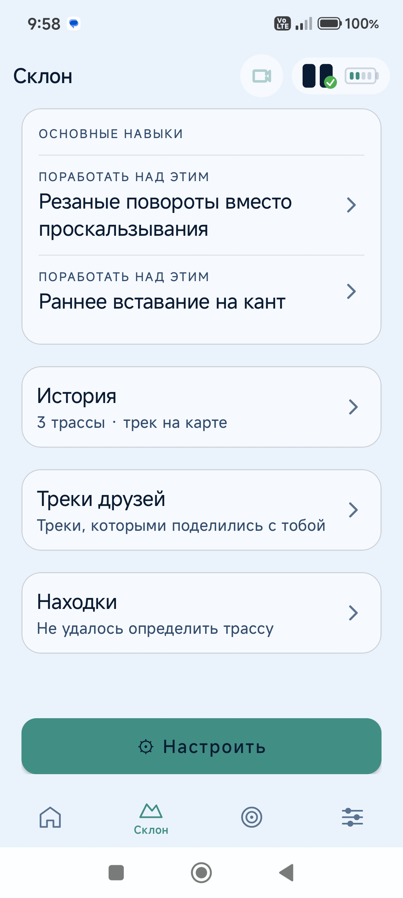

### 5.1 Начало сессии

Кнопка внизу экрана открывает настройку сессии:

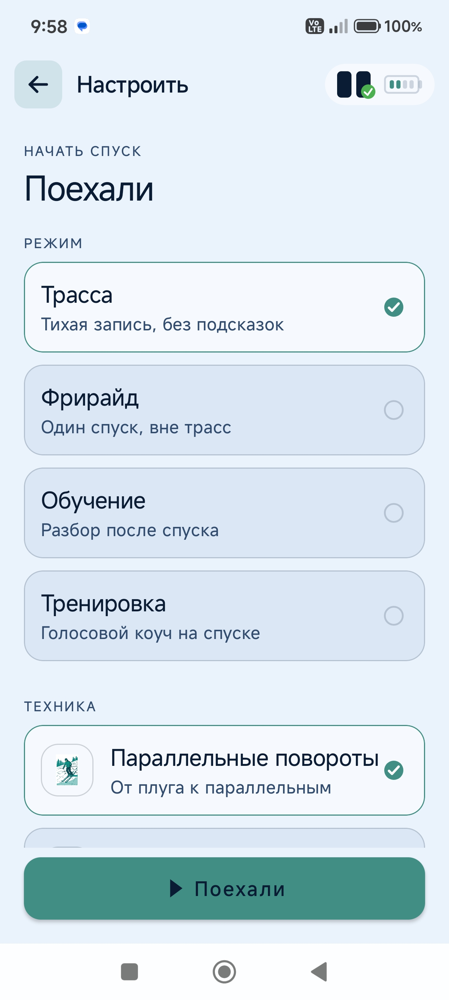

**Режим:**
- **Трасса** — тихая запись, без подсказок.
- **Фрирайд** — один спуск, вне трасс.
- **Обучение** — разбор после спуска.
- **Тренировка** — уведомления о правильном выполнении прямо во время спуска.

Прокрутите вниз, чтобы выбрать технику катания (используется для расчёта весов GF Score):

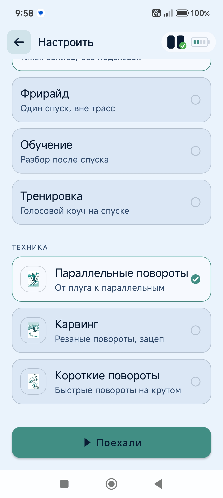

Нажмите **«▶ Поехали»** — начнётся запись. Пока сессия активна, кнопка внизу экрана «Склон» меняется на **«■ Готово на сегодня»**:

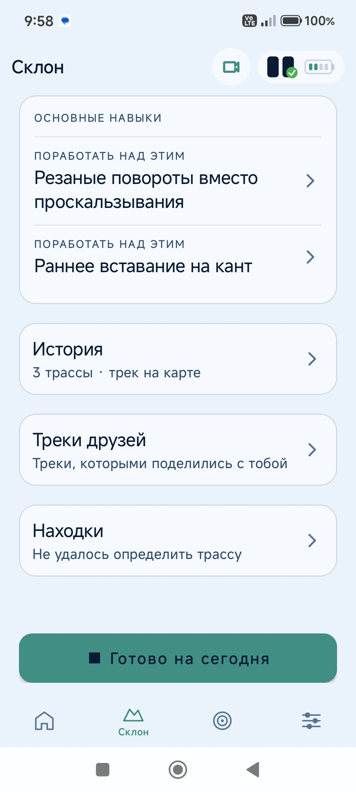

---

## 6. GF Score и разбор метрик

После завершения спуска откройте его из истории или с карточки «Последний спуск» — откроется экран деталей:

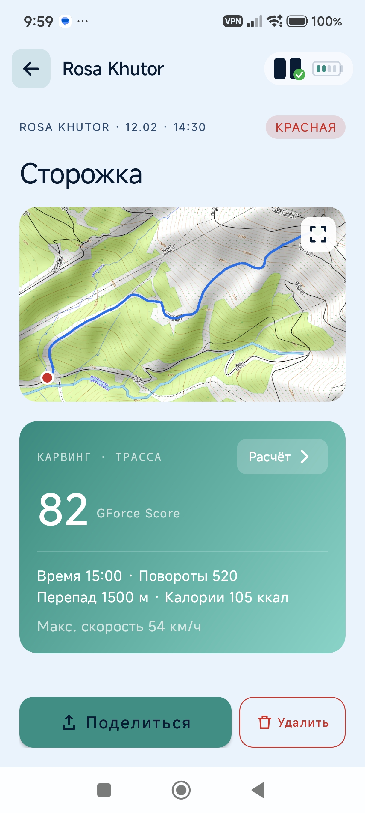

Зелёная карточка показывает итоговый **GF Score**, время/повороты/перепад/калории и макс. скорость. Кнопка **«Расчёт»** открывает подробную разбивку:

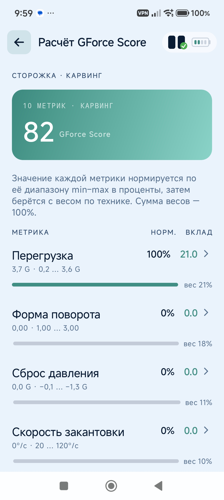

Каждая метрика нормируется по своему диапазону min–max в проценты, затем берётся с весом по выбранной технике катания — сумма весов всегда 100%. Набор метрик один и тот же, но их веса, а значит и порядок в разбивке, зависят от техники, выбранной при настройке сессии (раздел [5.1](#51-начало-сессии)):

- **Карвинг**: метрики по убыванию веса — Перегрузка → Форма поворота → Сброс давления → Скорость закантовки / Угол закантовки / Завершённость поворота (примерно поровну) → Синхронность лыж → Набор угла → Доля параллельной фазы → Плавность кантования.
- **Короткий радиус**: метрики по убыванию веса — Перегрузка → Синхронность лыж → Сброс давления → Угол закантовки → Скорость вращения → Форма поворота → Доля параллельной фазы.
- **Параллельные лыжи**: метрики по убыванию веса — Форма поворота → Перегрузка / Ритм поворотов / Плавность кантования (примерно поровну) → Сброс давления / Угол закантовки (примерно поровну) → Синхронность лыж → Доля параллельной фазы → Скорость закантовки → Завершённость поворота.

**Что означает каждая метрика:**

- **Перегрузка** — пиковая боковая перегрузка в повороте, в g. Чем выше скорость и меньше радиус поворота, тем больше G; у экспертов обычно 2–3g.
- **Форма поворота** — насколько равномерно лыжа проходит дугу поворота. Ближе к минимуму — чистая круглая дуга (карвинг); заметно выше — резкая, угловатая дуга (юз, проскальзывание).
- **Сброс давления** — насколько лыжник разгружает лыжи в момент смены канта между поворотами. Активная разгрузка облегчает переход в следующий поворот.
- **Скорость закантовки** — как быстро лыжник меняет угол закантовки. Быстрая, решительная закантовка — против вялого, медленного кантования.
- **Угол закантовки** — максимальный угол наклона лыжи на ребро в повороте. Чем агрессивнее закантовка, тем выше угол; у экспертов 50–70°.
- **Завершённость поворота** — на сколько градусов лыжник довернул лыжи за поворот. Большой угол — закрытый поворот с контролем скорости, малый — незакрытый, с разгоном.
- **Синхронность лыж** — насколько согласованно закантовываются левая и правая лыжа. Высокая синхронность — лыжи работают как одно целое.
- **Набор угла** — как равномерно нарастает угол закантовки в рабочей фазе поворота. Равномерное нарастание — хороший контроль дуги через весь апекс.
- **Доля параллельной фазы** — какую часть каждого поворота лыжи проводят параллельно друг другу, а не в клине.
- **Плавность кантования** — насколько стабилен угол закантовки без рывков. Высокая плавность — чистый рез; низкая — соскальзывание, «дребезжание» лыжи.
- **Скорость вращения** — как быстро лыжник доворачивает лыжи в уже закантованной фазе поворота (только для техники «Короткий радиус»).
- **Ритм поворотов** — количество поворотов в минуту (скользящее среднее). Высокий ритм — короткие быстрые повороты; низкий — длинные размашистые дуги.

В конце экрана — два инсайта:

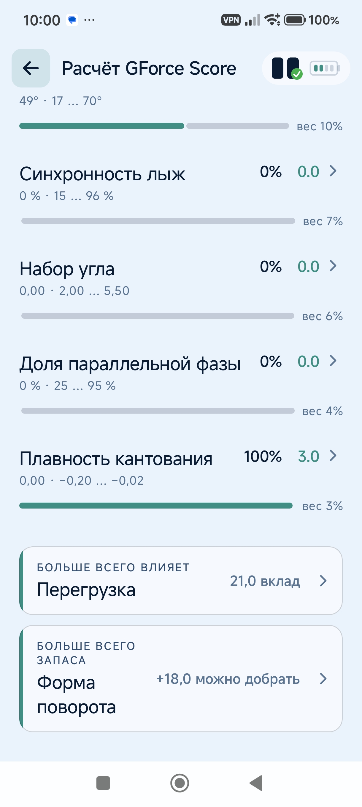

- **Больше всего влияет** — метрика с наибольшим вкладом в итоговый счёт.
- **Больше всего запаса** — метрика, где разница между весом и фактическим вкладом наибольшая (то есть больше всего можно «добрать»).

Нажатие на метрику или на инсайт разворачивает описание и (если для метрики есть привязанный навык) ссылку на соответствующую тренировку.

---

## 7. Видео с графиком score

Если во время сессии велась видеозапись (кнопка-камера в шапке экрана «Склон»), на карточке спуска и на экране расчёта GF Score появляется кнопка **«▶ Видео»**. Она открывает совместное воспроизведение видео и графика score с бегущим маркером текущей позиции:

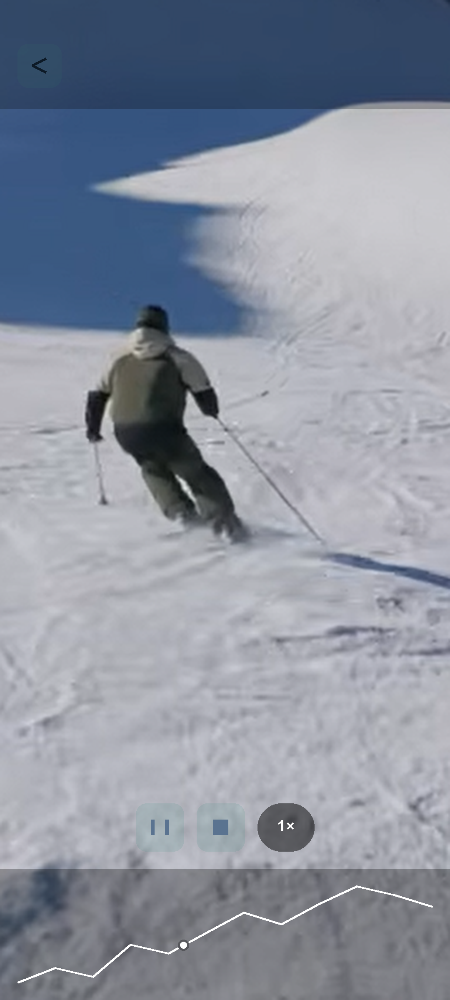

Управление внизу экрана:
- **Пауза / Играть** — остановить/возобновить воспроизведение.
- **Стоп** — пауза и перемотка в начало, маркер на графике сбрасывается на 0.
- **1× / 0.5× / 0.25×** — переключатель скорости воспроизведения (удобно для разбора техники покадрово).

---

## 8. История спусков

Карточка **«История»** на экране «Склон» → список курортов, где вы катались:

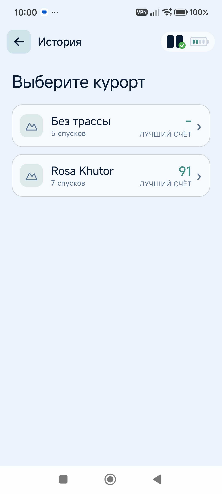

Выберите курорт, чтобы увидеть список спусков с фильтром **Сегодня / Сезон / Всё время**:

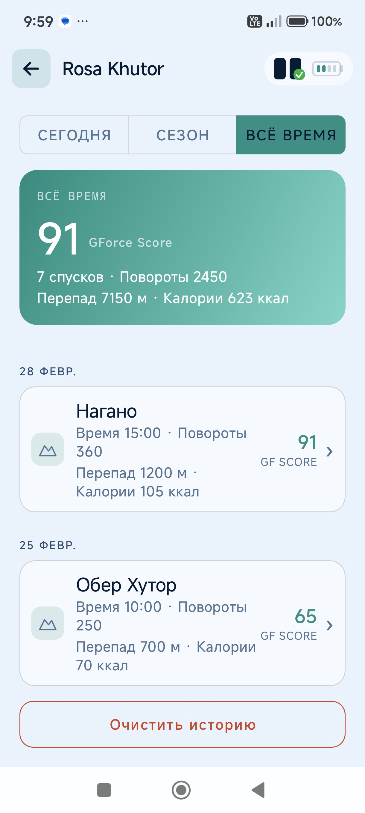

Сверху — сводная карточка (лучший счёт, число спусков, суммарные повороты/перепад/калории за выбранный период), ниже — список отдельных спусков по датам. Кнопка **«Очистить историю»** удаляет спуски выбранного курорта (не затрагивает профиль и прогресс навыков).

---

## 9. Находки — трассы, которые не удалось распознать

Если во время спуска приложению не удалось сопоставить GPS-трек с известной трассой (нет офлайн-данных курорта, либо трасса ещё не добавлена в OpenStreetMap), сессия попадает в **«Находки»**. Показываются только последние 10 находок (самые новые сверху) — более старые, если их накопится больше, в список не попадают:

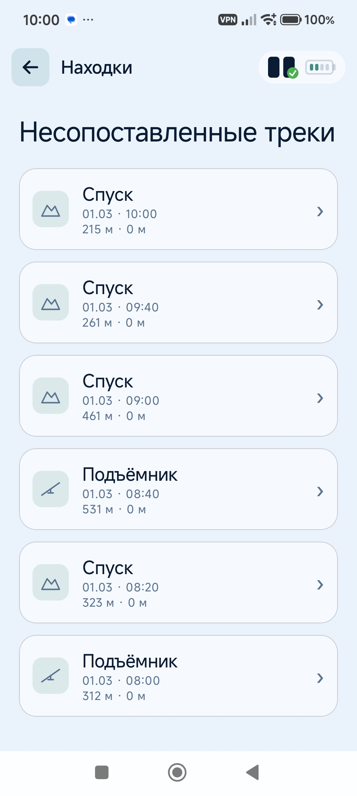

Нажмите на запись, чтобы добавить её на карту вручную:

**Для трассы** — укажите название курорта, название трассы и сложность:

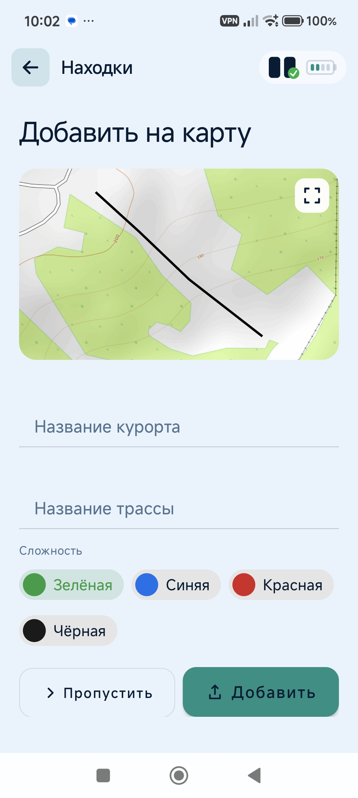

**Для подъёмника** — название курорта, название и тип подъёмника (гондола/кресельный/бугельный):

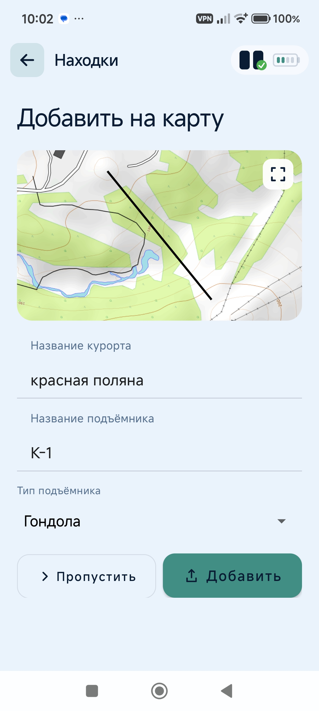

Кнопка **«Пропустить»** убирает запись из списка «Находки» без отправки данных на OpenStreetMap — сам трек при этом не удаляется, он остаётся в истории спусков, просто больше не появляется среди находок. **«Добавить»** отправляет трек на OpenStreetMap (нужен подключённый OSM-аккаунт — см. [раздел 11](#11-оффлайн-карты-и-вклад-в-osm)).

---

## 10. Тренировки

Вкладка **«Тренировка»** → выбор дисциплины:

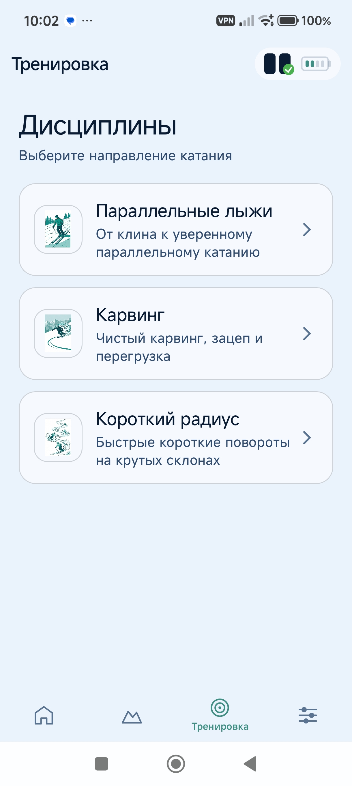

Каждая дисциплина (Параллельные лыжи / Карвинг / Короткий радиус) содержит набор навыков с текущим уровнем (0–30):

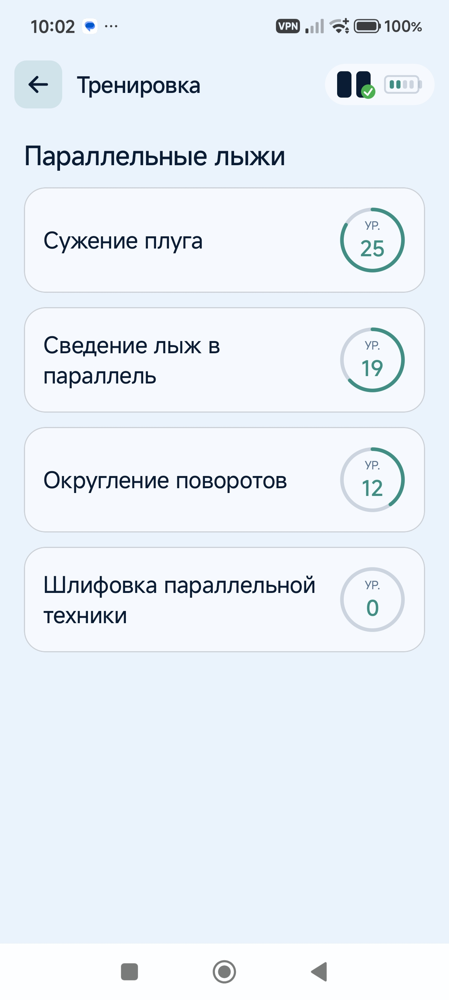

Внутри навыка — описание, текущий уровень, ссылка «Как измеряется» и цель следующего уровня с коротким обучающим видео:

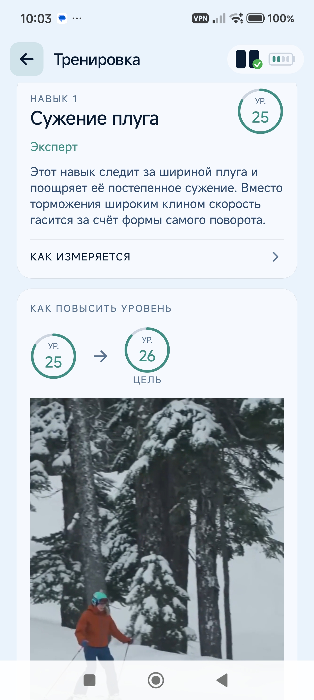

Ниже — конкретная числовая цель уровня (например, «8 поворотов подряд с шириной плуга < 10°») и кнопка **«Тренировать»**, которая запускает тренировку прямо на склоне. Если навык не даётся — блок **«Застряли? Попробуйте упражнение»** с видео вспомогательных упражнений:

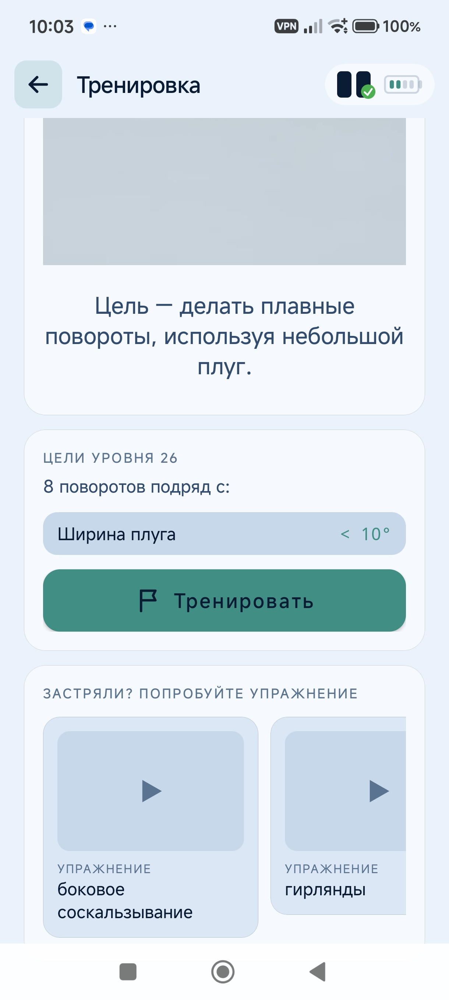

Другая дисциплина («Карвинг») со своим набором навыков — для примера:

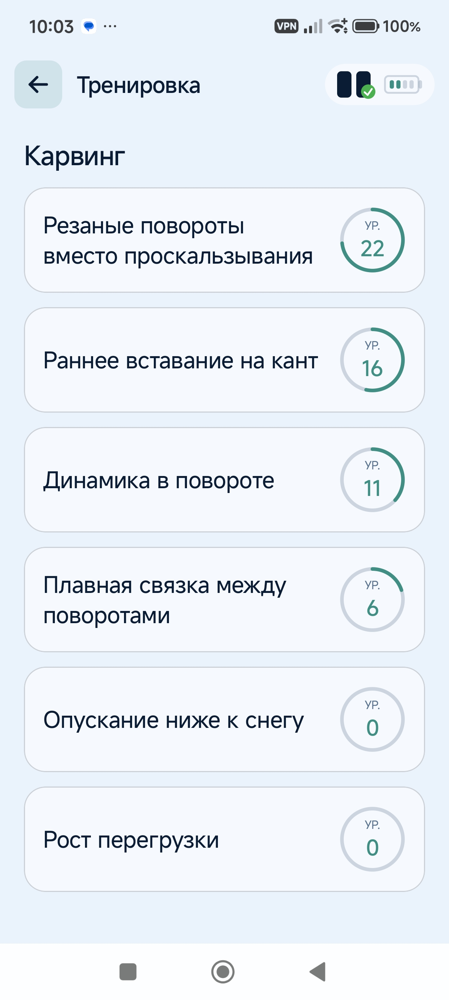

---

## 11. Оффлайн-карты и вклад в OSM

### 11.1 Оффлайн-данные

Карточка **«Карта»** на главном экране настроек → офлайн-загрузка трасс и подъёмников из OpenStreetMap:

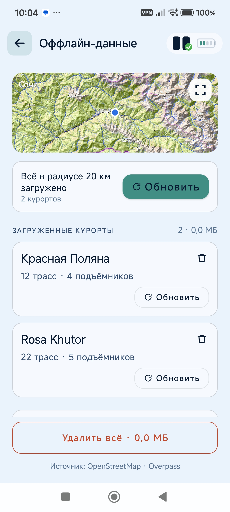

- **Всё в радиусе 20 км** — область вокруг текущего местоположения: при открытии экрана карта сама позиционируется по GPS. Точку можно поменять вручную — открыть карту на весь экран, переместить (см. ниже) и свернуть обратно: следующая загрузка пойдёт уже вокруг новой точки, а не GPS. Кнопка «Обновить» заново запрашивает у OpenStreetMap весь этот регион целиком (не только новое) и обновляет совпадающие трассы/подъёмники свежими данными. Если трасса пропала из OpenStreetMap с прошлого раза, локальная запись о ней не удаляется — просто останется устаревшей.
- **Загруженные курорты** — список уже скачанных курортов с числом трасс/подъёмников; у каждого своя кнопка обновления и удаления (значок корзины).
- **Догружать автоматически** — пока приложение открыто и есть Wi-Fi, а текущее местоположение ещё не попадает ни в один уже загруженный регион, приложение само докачивает данные вокруг него — специально нажимать «Обновить» не нужно:

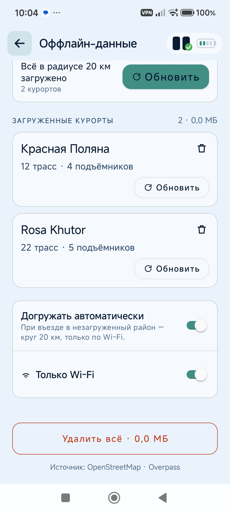

Нажатие на превью карты открывает её на весь экран (жесты масштабирования/перемещения):

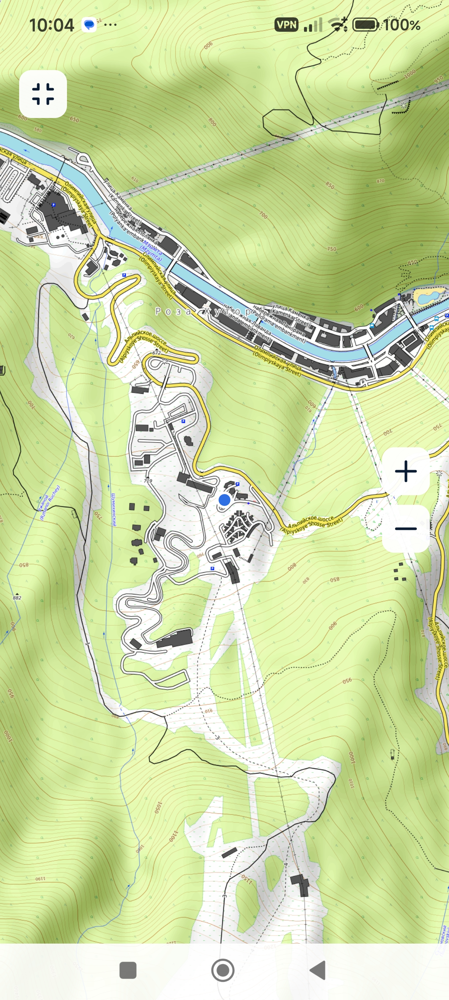

Если сеть недоступна и тайлы карты не загружены, вместо пустого/шахматного фона показывается значок карты и надпись «Нет соединения».

### 11.2 Интеграция с OSM

Отдельная карточка на главном экране настроек — загрузка ваших треков в OpenStreetMap:

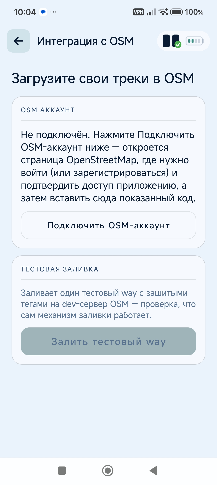

**Настройка аккаунта для загрузки:**
1. Нажмите **«Подключить OSM-аккаунт»** — в браузере откроется страница OpenStreetMap.
2. Войдите в свой аккаунт OpenStreetMap (или зарегистрируйте новый, если его ещё нет) и подтвердите доступ приложению.
3. OpenStreetMap покажет код авторизации — скопируйте его.
4. Вернитесь в приложение, во всплывшем окне «Вставь код из браузера» вставьте код и нажмите **«Подключить»**.

После подключения кнопка меняется на «Отключить», а находки (раздел 9) можно отправлять на карту одной кнопкой.

> Каждый пользователь подключает свой собственный аккаунт OpenStreetMap, а не общий аккаунт приложения — это намеренное решение: если кто-то отправит некорректные данные, санкции со стороны OpenStreetMap коснутся только его личного аккаунта, а не заблокируют загрузку для всех пользователей приложения сразу.

---

## 12. Треки друзей

Треки, которыми с вами поделились другие пользователи, доступны с карточки **«Треки друзей»** на экране «Склон»:

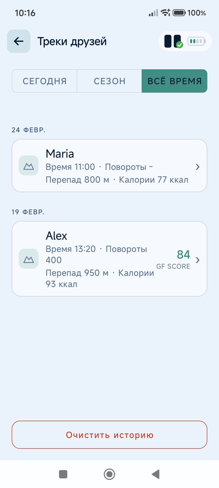

Список работает так же, как история собственных спусков (фильтр Сегодня/Сезон/Всё время). Открытие записи показывает те же детали спуска — карту, GF Score, статистику — что и для своих сессий:

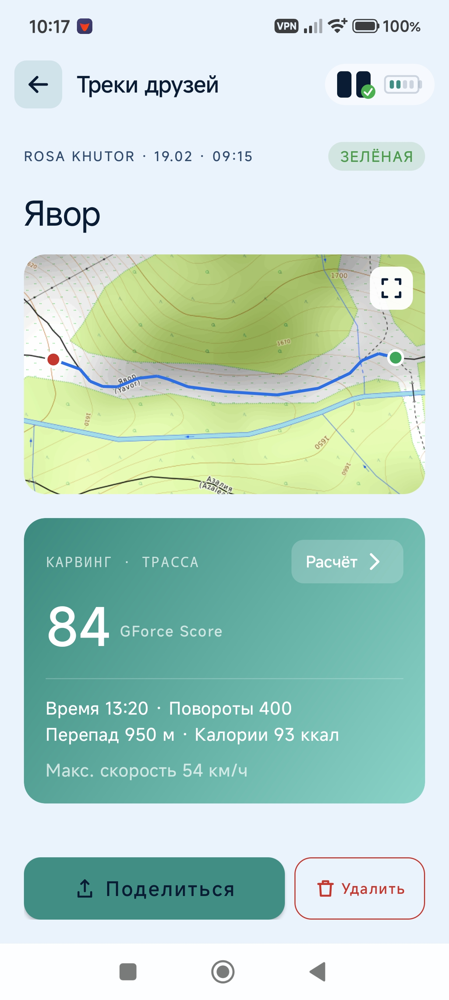

Поделиться своим спуском с друзьями можно кнопкой **«Поделиться»** на экране деталей любого своего спуска (раздел 6).

---

## 13. Настройки приложения

Вкладка **«Конфигурация»** (последняя иконка нижней навигации) — точка входа во все разделы настроек:

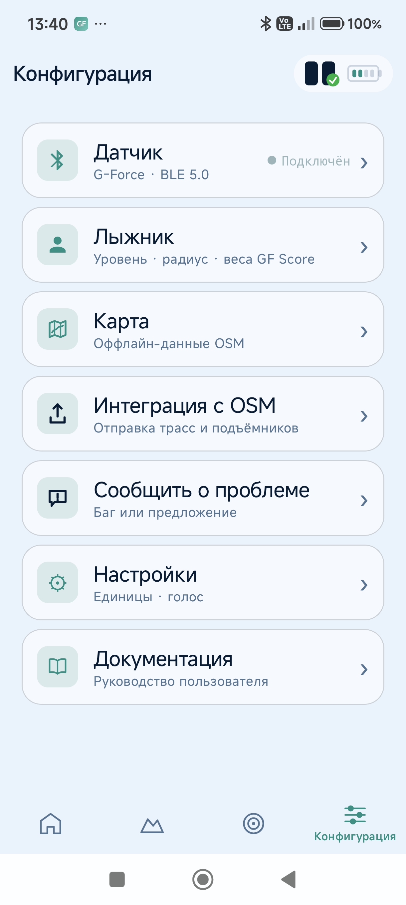

- **Датчик** — статус подключения (раздел 2.2).
- **Лыжник** — профиль (раздел 3).
- **Карта** — офлайн-данные (раздел 11.1).
- **Интеграция с OSM** — загрузка треков (раздел 11.2).
- **Настройки** — единицы измерения (метрические/имперские), тип сенсора (в релизных сборках скрыт — используется только реальный датчик G-Force) и голосовые подсказки:

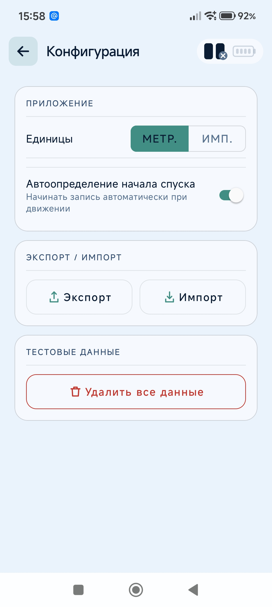

---

## 14. Как собрать датчик своими руками

G-Force не привязан к фирменному «железу» — пара датчиков собирается самостоятельно из недорогих компонентов, заказанных на маркетплейсе.

### 14.1 Что понадобится

На **один** датчик (для полноценной работы приложения нужно собрать **два** — на левую и правую ногу):

1. **Датчик WITMOTION WT9011DCL** — BLE-модуль с акселерометром, гироскопом и магнитометром, именно он передаёт данные в приложение.
2. **Пластиковая коробочка** подходящего размера — корпус, защищающий плату от влаги и ударов.
3. **Металлическая клипса** — крепление корпуса на пряжку или язык ботинка.

Все три позиции были куплены на Ozon, себестоимость одного датчика в сборе — около **2500 ₽**. Для пары датчиков, соответственно, ~5000 ₽ — заметно дешевле готовых фирменных решений с аналогичной функциональностью.

Из инструментов пригодится небольшая крестовая отвёртка (клипса крепится к корпусу винтами) и, желательно, кусочек двустороннего скотча или термоклей, если штатная посадка датчика в коробочке окажется свободной.

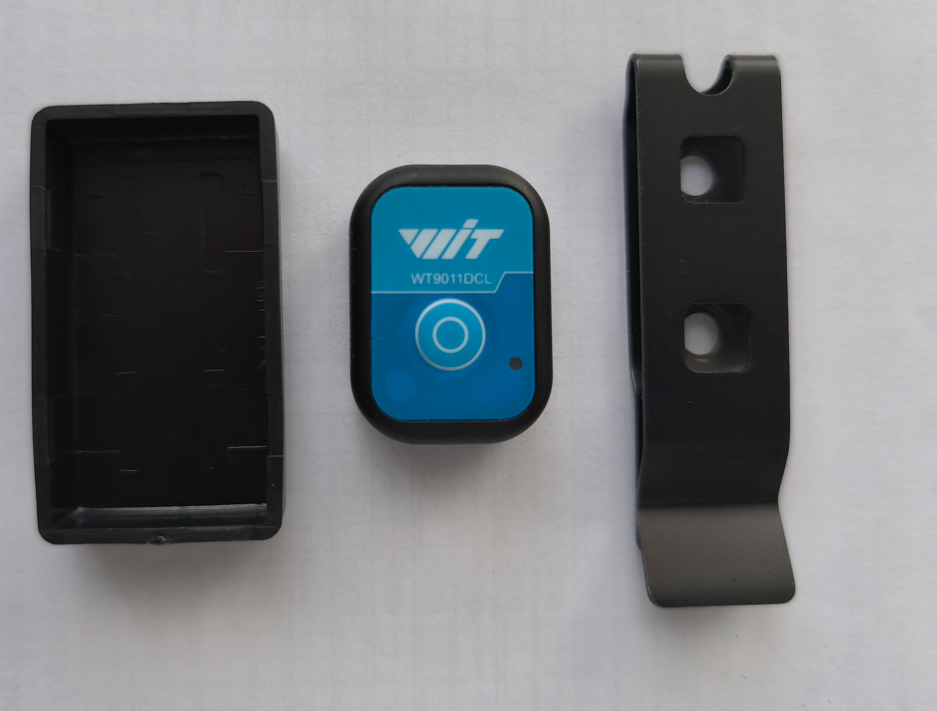

### 14.2 Сборка

1. Уложите датчик WT9011DCL в нижнюю часть коробочки контактной кнопкой вверх — большинство корпусов такого размера имеют внутренние рёбра, которые фиксируют плату без люфта.
2. Закройте корпус крышкой до щелчка (либо затяните штатный винт, если он предусмотрен конструкцией коробочки).
3. Прикрутите клипсу к задней стенке корпуса — обычно двумя винтами через готовые отверстия.

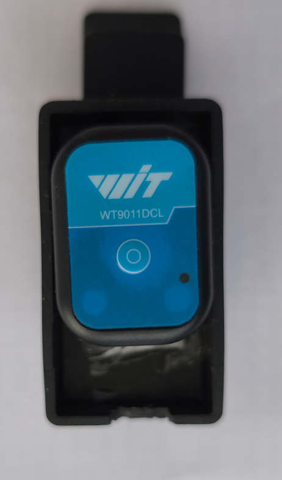

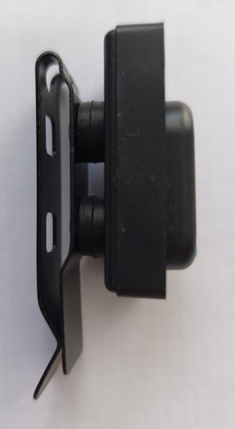

Повторите сборку для второго датчика — на этом этапе не важно, какой из двух станет «левым», а какой «правым»: это определяется не при сборке, а при первом сопряжении с приложением (см. [раздел 2.1](#21-привязка-датчиков-первое-подключение)) — вы встряхиваете один из датчиков, и он назначается левым, второй автоматически становится правым.

### 14.3 Крепление на ботинок

Клипса рассчитана на крепление сбоку ботинка, на ремне — так, чтобы датчик плотно прилегал и не болтался во время катания (любой люфт корпуса добавляет шум в данные акселерометра и гироскопа). Крепите оба датчика симметрично — на одном и том же месте на обоих ботинках, иначе показания закантовки будут несопоставимы между ногами.

> Перед первым катанием после сборки выполните калибровку в нейтральной стойке — раздел [2.2](#22-экран-датчик--статус-заряд-калибровка). Также после установки в новый корпус возможен небольшой дрейф магнитометра из-за металлических деталей клипсы — если заметите нестабильный курс/вращение, переустановите калибровку ещё раз, уже стоя на лыжах в ботинках.

### 14.4 Обслуживание

- Заряжайте датчики через штатный разъём на плате WT9011DCL — индикатор при зарядке горит красным, при полном заряде переключается на зелёный.
- Пластиковый корпус не рассчитан на герметичность — избегайте погружения в снег на длительное время и просушивайте корпус изнутри, если внутрь попала влага.
- Периодически проверяйте затяжку винтов клипсы — вибрация при катании со временем их ослабляет.

---

*Документация подготовлена для G-Force Skiing.*
